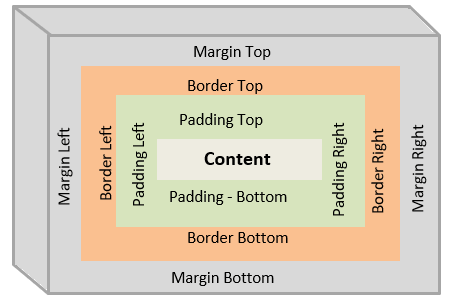
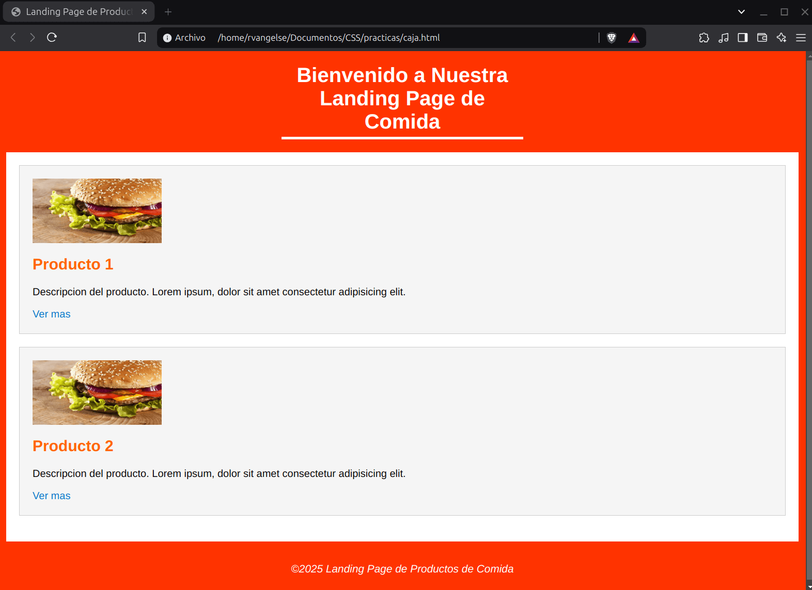

# Modelo de caja

<p align="center">
  
</p>

### Caja

```css
span {
  /* Etiqueta de linea */
  /* Color del fondo de la caja */
  background-color: red;
  /* Espacio entre el contenido y la caja */
  padding: 10px;
  /* Borde de la caja */
  border: 10px solid blue;
  /* Margen alrededor de la caja */
  margin: 20px;
  /* Ancho de la caja */
  width: 100px;
  /* Alto de la caja */
  height: 100px;
  box-sizing: border-box; /* Se incluye el margin, el border y el padding a las dimensiones de la caja, el contenido se adapta */
  display: block; /* Transforma la etiqueta en una etiqueta de bloque */
}
```

OJO: `box-sizing: content-box;` viene por default.
OJO: Es una buena practica usar `box-sizing: border-box;`

---

### Margen y relleno

```css
div,
span {
  background-color: red;
  /* Arriba-Derecha-Abajo-Izquierda */
  padding: 100px 20px 30px 80px;
  /* Arriba-DerechaIzquierda-Abajo */
  padding: 100px 40px 30px;
  /* ArribaAbajo-DerechaIzquierda */
  padding: 100px 40px;
  /* ArribaDerechaAbajoIzquierda */
  padding: 10px;
  /* Se puede aislar, tambien */
  padding-top: 10px;
  /* Funciona igual para el margin */
  margin: 1px 20px 40px 5px;
  display: inline-block;
}
```

### Borde

```css
span {
  display: inline-block;
  padding: 20px;
  /* Borde simplificado */
  border: outset 15px red;
  /* Borde por parametros */
  border-style: outset;
  border-width: 15px;
  border-color: red;
  /* Borde por direcciones y parametros */
  border-top-color: blue;
  border-right-color: green;
  border-left-color: yellow;
  border-bottom-color: black;

  border-top-style: dotted;

  border-bottom-width: 5px;
}
```

---

### Contorno
Es una especie de borde extra-caja. 

```css
span {
  display: inline-block;
  padding: 20px;
  /* Contorno simplificado */
  outline: solid 20px red; 
  /* Contorno por parametros */
  outline-style: solid;
  outline-width: 20px;
  outline-color: red;
}
```
OJO: No existe `outline-top-color: blue;`

OJO: Utiliza el contorno para enfatizar algunos elementos interactivos en tu página.

---
### Practica 3: Modelo de caja

**Codigo**
```html
<!DOCTYPE html>
<html lang="es">
<head>
    <meta charset="UTF-8">
    <meta name="viewport" content="width=device-width, initial-scale=1.0">
    <title>Landing Page de Productos de Comida</title>
</head>
<style>
    
    body{
        font-family: Arial, sans-serif;
        margin: 0;
        background-color: hsl(12, 100%, 50%);
        padding: 0;
    }

    #encabezado {
        padding: 20px 0;
    }

    #encabezado h1{
        color: white;
        text-align: center;
        padding-bottom: 5px; 
        width: 30%;
        margin: auto;

        border-bottom: 4px solid white;
    }

    #contenedor{
        background: white;
        width: 95%;
        margin: auto;
        padding: 20px;
    }

    h2{
        font-size: 24px;
        margin: 20px 0;
        color: #ff6600;
    }

    .producto{
        padding: 20px;
        margin-bottom: 20px;
        border: 1px solid #ccc;
        box-sizing: border-box;
        background-color: #f5f5f5;
    }

    .producto img{
        width: 200px;
        height: 100px;
        display: block;
        margin-bottom: 10px;
    }

    a{
        color: #0077cc;
        text-decoration: none;
    }

    footer{
        color: white;
        text-align: center;
        font-style: italic;
        padding: 30px 0;
        font-size: 20px;

    }

</style>
<body>
    <header id="encabezado">
        <h1>Bienvenido a Nuestra Landing Page de Comida</h1>
    </header>
    <main id ="contenedor">
        <div class="producto">
            
            <h2>Producto 1</h2>
            <p>Descripcion del producto. Lorem ipsum, dolor sit amet consectetur adipisicing elit.</p>
            <a href="#">Ver mas</a>
        </div>
        <div class="producto">
            
            <h2>Producto 2</h2>
            <p>Descripcion del producto. Lorem ipsum, dolor sit amet consectetur adipisicing elit.</p>
            <a href="#">Ver mas</a>
        </div>
    </main>
    <footer>
        <small>&copy2025 Landing Page de Productos de Comida</small>
    </footer>
</body>
</html>
```
**Output**

<p align="center">
  
</p>

