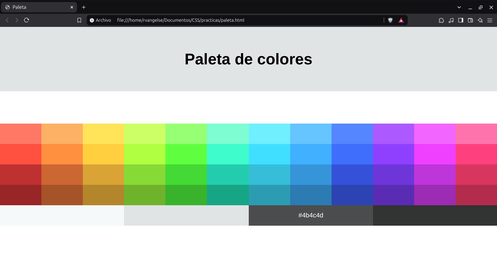

# Complementos

### Prefijos y soporte

```css
h1 {
      -webkit-transition: all 4s ease; /* Prefijo de soporte para Chrome */
      -moz-transition: all 4s ease; /* Prefijo de soporte para Mozilla */
      -ms-transition: all 4s ease; /* Prefijo de soporte para Internet Explorer */
      -o-transition: all 4s ease; /* Prefijo de soporte para Opera */
      transition: all 4s ease; /* Soportes unificados */
    }
```
OJO: Existen recursos para hacer esto más fácil, por ejemplo: 

* [Can I use?](https://caniuse.com/) es una página que te muestra en que navegadores esta disponible una determinada propiedad. 

* [autoprefixer](https://www.npmjs.com/package/autoprefixer) es un plugin que se encarga de chequear todo esto.

---
### Practica Extra: Paleta de Colores

**Codigo**
```html
<!DOCTYPE html>
<html lang="es">
<head>
    <meta charset="UTF-8">
    <meta name="viewport" content="width=device-width, initial-scale=1.0">
    <title>Paleta</title>
    <style>
        body{
            margin: 0;
            padding: 0;
            font-family: Arial, sans-serif;
        }

        header{
            text-align: center;
            background-color: #e1e4e5;
            padding: 40px;

            h1{
                font-size: 3rem;
            }
        }
 
        main{
            margin-top: 100px;
            display: grid;
            grid-template-columns: repeat(12, 1fr);
            gap: 0;
            flex-wrap: wrap;

            div{
                padding: 20px;
                text-align: center;
                color: transparent;
                font-size: 20px;
                transition: color 0.3s ease-in-out;

                &:hover{
                    color:black;
                }
            }

            .largo, .largo-blanco{
            grid-column: span 3; /* Ocupan 3 columnas */
            }

            .largo-blanco:hover{
                color: white;
            }
        }

    </style>
</head>
<body>
    <header>
        <h1>Paleta de colores</h1>
    </header>
    <main>
        <div style ="background-color: #ff7866;">#ff7866</div>
        <div style ="background-color: #fcb165;">#fcb165</div>
        <div style ="background-color: #ffe359;">#ffe359</div>
        <div style ="background-color: #ccff66;">#ccff66</div>
        <div style ="background-color: #96ff73;">#96ff73</div>
        <div style ="background-color: #7efcd2;">#7efcd2</div>
        <div style ="background-color: #70efff;">#70efff</div>
        <div style ="background-color: #66c4ff;">#66c4ff</div>
        <div style ="background-color: #5585ff;">#5585ff</div>
        <div style ="background-color: #ac59ff;">#ac59ff</div>
        <div style ="background-color: #f266ff;">#f266ff</div>
        <div style ="background-color: #ff73ad;">#ff73ad</div>
        <div style ="background-color: #ff5040;">#ff5040</div>
        <div style ="background-color: #fe9040;">#fe9040</div>
        <div style ="background-color: #ffcf40;">#ffcf40</div>
        <div style ="background-color: #b0ff40;">#b0ff40</div>
        <div style ="background-color: #5fff40;">#5fff40</div>
        <div style ="background-color: #3ffccd;">#3ffccd</div>
        <div style ="background-color: #40dfff;">#40dfff</div>
        <div style ="background-color: #40b0ff;">#40b0ff</div>
        <div style ="background-color: #3f6efc;">#3f6efc</div>
        <div style ="background-color: #8f40ff;">#8f40ff</div>
        <div style ="background-color: #ef40ff;">#ef40ff</div>
        <div style ="background-color: #ff407f;">#ff407f</div>
        <div style ="background-color: #bf3030;">#bf3030</div>
        <div style ="background-color: #cc6633;">#cc6633</div>
        <div style ="background-color: #d9a336;">#d9a336</div>
        <div style ="background-color: #87d936;">#87d936</div>
        <div style ="background-color: #44d934;">#44d934</div>
        <div style ="background-color: #23CCAC;">#23CCAC</div>
        <div style ="background-color: #36bed9;">#36bed9</div>
        <div style ="background-color: #3695d9;">#3695d9</div>
        <div style ="background-color: #3651d9;">#3651d9</div>
        <div style ="background-color: #6e36d9;">#6e36d9</div>
        <div style ="background-color: #be36d9;">#be36d9</div>
        <div style ="background-color: #d9365f;">#d9365f</div>
        <div style ="background-color: #992626;">#992626</div>
        <div style ="background-color: #A65329;">#A65329</div>
        <div style ="background-color: #B3862C;">#B3862C</div>
        <div style ="background-color: #6FB32C;">#6FB32C</div>
        <div style ="background-color: #38B32B;">#38B32B</div>
        <div style ="background-color: #16A585;">#16A585</div>
        <div style ="background-color: #2C9CB3;">#2C9CB3</div>
        <div style ="background-color: #2C7BB3;">#2C7BB3</div>
        <div style ="background-color: #2C43B3;">#2C43B3</div>
        <div style ="background-color: #592CB3;">#592CB3</div>
        <div style ="background-color: #9C2CB3;">#9C2CB3</div>
        <div style ="background-color: #B32C4E;">#B32C4E</div>
        <div class="largo" style ="background-color: #f5f9fa;">#f5f9fa</div>
        <div class="largo" style ="background-color: #e1e4e5;">#e1e4e5</div>
        <div class="largo-blanco" style ="background-color: #4b4c4d;">#4b4c4d</div>
        <div class="largo-blanco" style ="background-color: #323333;">#323333 </div>   
    </main>
</body>
</html>
```
**Output**

<p align="center">
  
</p>

OJO: Este proyecto no es `responsive`