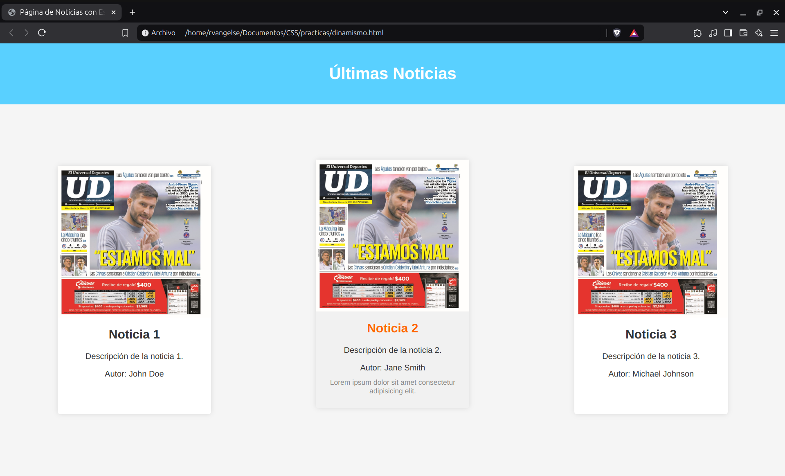
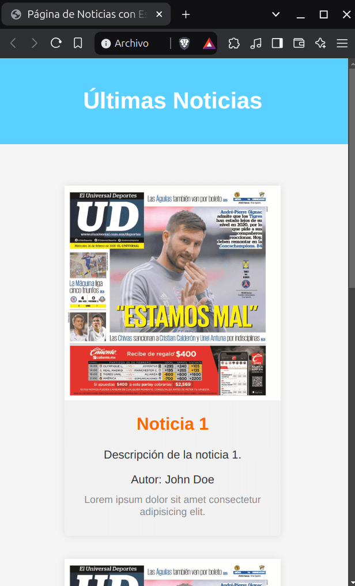

# Dinamismo

### Transformaciones
Las `transformaciones` permiten agregarles una mayor interactividad a tus elementos, van de la mano con las ` animaciones`

```css

/* Translaciones */
div {
    width: 100px;
    height: 100px;
    background-color: coral;
    transform: translateX(50px); /* Translacion en el eje X */
    transform: translateY(50px); /* Translacion en el eje Y */
    transform: translate(50px, 50px); /* Translacion en los ejes X e Y */
}

/* Agrandamientos */
div {
    width: 100px;
    height: 100px;
    background-color: skyblue;
    transform: scaleX(1.5); /* Agranda al elemento en su eje X */
    transform: scaleY(1.5); /* Agranda al elemento en su eje Y */
    transform: scale(.5); /* Agranda al elemento en sus ejes X e Y */
}

/* Rotaciones */
div {
    width: 100px;
    height: 100px;
    background-color: lightgreen;
    transform: rotateX(30deg); /* Rota al elemento sobre su eje X */
    transform: rotateY(30deg); /* Rota al elemento sobre su eje Y */
    transform: rotate(30deg); /* Rota al elemento sobre sus ejes X e Y */
}

/* Distorsiones */
div {
    width: 100px;
    height: 100px;
    background-color: plum;
    transform: skewX(30deg); /* Distorsiona al elemento en su eje X */
    transform: skewY(30deg); /* Distorsiona al elemento en su eje Y */
    transform: skew(30deg, 20deg); /* Distorsiona al elemento en sus ejes X e Y */
}

/* Transformaciones completas */
div {
    width: 100px;
    height: 100px;
    background-color: aquamarine;
    transform: translate(50px, 50px) scale(.8) rotate(.3turn) skew(30deg, 20deg);
}
```
OJO: No todos los elementos se pueden transformar.

---
### Transiciones
Las `transiciones`son el cambio de un elemento de un estado a otro, usando CSS

```css
/* En esta transicion el elemento duplica su width al posar el cursor sobre el */
div {
    width: 150px;
    height: 150px;
    background-color: coral;
    /* Propiedad - Intervalo - Curva de efecto */
    transition: width 1s ease-in-out;

    &:hover{
        width: 300px;
    }
}
```
---
### Animaciones
Son `transiciones` que nos bridan un mayor control. Pueden repetirse indefinidamente

```css

/* Esta animacion transladara 200 px a nuestro elemento */
@keyframes mover {
    0% { /* Estado inicial */
        transform: translateX(0);
    }

    100% { /* Estado final */
        transform: translateX(200px);
    }
}

div {
    width: 100px;
    height: 100px;
    background-color: royalblue;

    /* Animacion por parametros */
    animation-name: mover; /* Le asigno la animacion antes creada */
    animation-duration: 2s; /* Intervalo */
    animation-timing-function: ease-in-out; /* Curva de animacion */
    animation-iteration-count: infinite; /* Numero de veces que se repetira la animacion */

    /* Animacion refactorizada */
    animation: mover 2s ease-in-out infinite; 
}
```
OJO: Puedes crear `estados intermedios`en las animaciones.

OJO: Un error común es usar valores absolutos (`px`) en lugar de relativos (`%`), al asignar valores en las propiedades que se animarán.

---
### Practica 7: Dinamismo en CSS

**Codigo**
```html

<!DOCTYPE html>
<html lang="es">
<head>
    <meta charset="UTF-8">
    <meta name="viewport" content="width=device-width, initial-scale=1.0">
    <title>Página de Noticias con Estilos CSS</title>
    <style>
        body {
            font-family: Arial, sans-serif;
            margin: 0;
            padding: 0;
            background-color: #f5f5f5;
            color: #333;
        }

        header {
            background-color: hwb(197 35% 0%);
            color: #fff;
            text-align: center;
            padding: 20px 0;
        }

        main {
            display: flex;
            flex-wrap: wrap;
            justify-content: space-around;
            gap: 20px;
            padding: 20px;
            margin-top: 100px;
        }

        .noticia {
            width: 300px;
            background-color: #fff;
            border-radius: 5px;
            box-shadow: 0 0 10px rgba(0, 0, 0, 0.1);
            transition: transform 0.3s ease-in-out;
            cursor: pointer;

            img {
                width: 100%;
                height: auto;
            }

            div{
                padding: 15px;
                text-align: center;
                transition: background-color 0.3s;

                h2{
                    transition: color 0.3s;
                    margin-top: 0;
                }

                p {
                    margin-bottom: 10px;
                }

                p:nth-child(4) {
                    color: #888;
                    font-size: 14px;
                    margin-top: 10px;
                    opacity: 0; /* Oculto el párrafo */
                    transition: opacity 0.3s;
                }
            }

            &:hover, &:active {
                transform: translateY(-12px);
                background-color: #f1f1f1;

                h2 {
                    color: #ff6600;
                }

                p:nth-child(4) {
                    opacity: 1; /* Muestro el párrafo */
                }
            }
        }

        @media (max-width: 600px) {

            main{
                margin-top: 50px;
            }
        }

    </style>
</head>
<body>
    <header>
        <h1>Últimas Noticias</h1>
    </header>
    <main>
        <div class="noticia">
            
            <div>
                <h2>Noticia 1</h2>
                <p>Descripción de la noticia 1.</p>
                <p>Autor: John Doe</p>
                <p>Lorem ipsum dolor sit amet consectetur adipisicing elit.</p>
            </div>
        </div>
        <div class="noticia">
            
            <div>
                <h2>Noticia 2</h2>
                <p>Descripción de la noticia 2.</p>
                <p>Autor: Jane Smith</p>
                <p>Lorem ipsum dolor sit amet consectetur adipisicing elit.</p>
            </div>
        </div>
        <div class="noticia">
            
            <div>
                <h2>Noticia 3</h2>
                <p>Descripción de la noticia 3.</p>
                <p>Autor: Michael Johnson</p>
                <p>Lorem ipsum dolor sit amet consectetur adipisicing elit.</p>
            </div>
        </div>
    </main>
</body>
</html>
```
**Output**

<div style="display: flex; justify-content: space-around; flex-wrap: wrap; ">
  <figure>
    
    <p text-aling="center">Desktop</p>
  </figure>
  <figure>
    
  </figure>
</div>