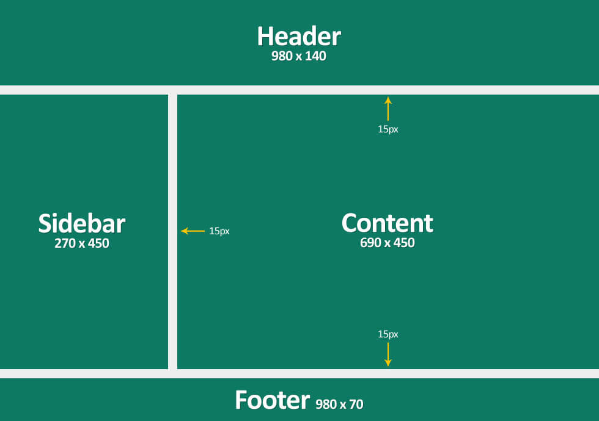

# Disposición
### Diseños
`Layout`es una forma de estructurar diferentes partes de una aplicacion/pagina web de forma que estas ocupen un espacio que sea coherente. 

Ejemplo de `Layout`:

  

OJO: Antes se organizaban los elementos de una aplicacion/pagina web usando tablas.

OJO: Es una buena practica, usar `flex-box` y `CSS-grid` para diseñar tus layouts.

---

###