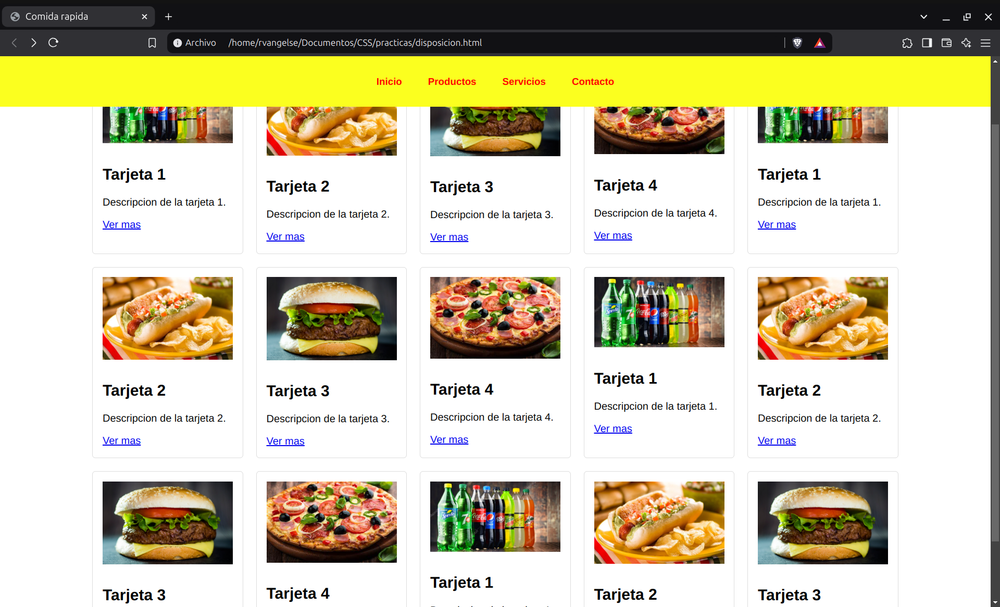

# Disposición

### Diseños

`Layout`es una forma de estructurar diferentes partes de una aplicacion/pagina web de forma que estas ocupen un espacio que sea coherente.

Ejemplo de `Layout`:

<p align="center">
  
</p>

OJO: Antes se organizaban los elementos de una aplicacion/pagina web usando tablas.

OJO: Es una buena practica, usar `Flexbox` y `CSS Grid` para diseñar tus layouts.

---

### Posiciones

```css
div {
  width: 80px;
  height: 80px;
  position: relative; /* Sus elementos hijos lo usaran como sistema de referencia para su posicion */
}

#primero {
  /* Posicion por default */
  position: static;

  /* Posicion relativa al flujo del documento */
  position: relative;
  top: 10px;
  left: 50px;
  bottom: 20px;
  right: 10px;

  /* Posicion relativa a un sistema de referencia, fuera del flujo del documento */
  position: absolute;
  z-index: 1; /* Variable de altura relativa */
  left: 20px;
  top: 40px;

  /* Igual que absolute, solo que se mantiene flotando */
  position: fixed;
  left: 20px;
  top: 40px;
}
```

OJO: Si no especificas un padre como `relative` al usar `position: absolute` o `position: fixed`, el padre sera el documento html.

---

### Flotados

Son muy utiles cuando quieres envolver una imagen o contenedor con texto, tipo nota-periodico.

```css
div {
  display: inline-block;
  width: 80px;
  height: 80px;
}

#primero {
  float: left; /* El elemento flota a la izquierda */
}

#segundo {
  float: right;
}

p {
  text-align: justify;
  clear: both; /* Hace que el texto no envuelva a los floats, los ignora */
}
```

OJO: `overflow: hidden;` evita que los elementos floten fuera de su contenedor.

---

### Caja flexible

`Flexbox` sirve para alinear elementos dentro de un contenedor, haciendolos adaptables y responsivos.

Es perfecto para ordenar elementos en una sola dimension.

```css
.contenedor {
  height: 80px;
  background: rgb(187, 255, 0);
  display: flex; /* Los elementos dentro del contenedor seran flexibles */
  flex-direction: row; /* Se posicionaran en fila */
  justify-content: center; /* Espacio entre los elementos del contenedor (eje principal) */
  align-items: center; /* Espacio entre los elementos del contenedor (eje opuesto) */
  flex-wrap: wrap; /* Cuando se alcanza el "max-width", salta a la siguiente linea */
}
```

OJO: Puedes profundizar mas en flexbox con recursos como [CSS Flexible Box Layout Module](https://www.w3.org/TR/css-flexbox-1/) o [Flexbox Froggy](https://flexboxfroggy.com/#es).

---

### Cuadrícula

`CSS Grid` es perfecto para ordenar elementos en dos dimensiones.

```css
/*OJO: Este es el truco para ocupar toda la pagina */
html {
  height: 100%; /* OJO */
  margin: 0;
  padding: 0;
}

body {
  min-height: 100%; /* OJO */
  display: grid;
  grid-template-columns: 100px auto; /* 2 columnas */
  grid-template-rows: 40px auto 100px; /* 3 filas */
  gap: 10px; /* Espacio entre elementos */
}

/* Formateo los elementos del grid (contenedores)*/
nav, aside, main, footer {
  border-radius: 5px;
  display: flex;
  align-items: center;
  justify-content: center;
  text-align: center;
}

nav {
  background: lightsalmon;
  justify-content: space-around;
  /* Posicion Vertical */
  grid-row-start: 1; /* Empieza en la fila 1 */
  grid-row-end: 2; /* Termina en la fila 2 */
  /* Posicion Horizontal */
  grid-column-start: 1; /* Empieza en la columna 1 */
  grid-column-end: 3; /* Termina en la columna 3 */
}

aside {
  background: violet;
  grid-row-start: 2;
  grid-row-end: 3;
}

main {
  background: greenyellow;
  grid-row-start: 2;
  grid-row-end: 3;
}

footer {
  background: lightseagreen;
  grid-row-start: 3;
  grid-row-end: 4;
  grid-column-start: 1;
  grid-column-end: 3;
}
```
OJO: Puedes usar recursos como [Grid Garden](https://cssgridgarden.com/#es) para profundizar mas en `CSS Grid`.

OJO: Es más eficiente y fácil manejar tus elementos si los separas en multiples cuadrículas pequeñas.

OJO: `CSS Grid` funciona mejor en conjunto con otras técnicas de diseño, como `Flexbox`.

---
### Practica 5: Disposicion en CSS

**Codigo**
```html
<!DOCTYPE html>
<html lang="es">
<head>
    <meta charset="UTF-8">
    <meta name="viewport" content="width=device-width, initial-scale=1.0">
    <title>Comida rapida</title>
    <style>
        body {
            font-family: Arial, sans-serif;
            margin: 0;
            padding: 0;
        }

        header {
            position: fixed;
            top: 0;
            left: 0;
            width: 100%;
            background-color: hsl(61, 100%, 56%);
            padding: 20px 0;
            text-align: center;
        }

        nav{
            display: flex;
            justify-content: center;
        }

        nav a {
            color: hsl(0, 100%, 50%);
            font-size: 15px;
            font-weight: bold;
            padding: 10px 20px;
            text-decoration: none;
        }

        main {
            padding: 120px 20px 20px; 
            display: flex;
            flex-wrap: wrap;
            justify-content: center;
        }

        div{
            border: 1px solid #ddd;
            border-radius: 5px;
            padding: 15px;
            margin: 10px;
            width: 200px;
        }

        div img{
            width: 100%;
            height: auto;
            margin-bottom: 10px;
        }
    </style>
</head>
<body>
    <header>
        <nav>
            <a href="#">Inicio</a>
            <a href="#">Productos</a>
            <a href="#">Servicios</a>
            <a href="#">Contacto</a>
        </nav>
    </header>
    <main>
        <div>
            
            <h2>Tarjeta 1</h2>
            <p>Descripcion de la tarjeta 1.</p>
            <a href="#">Ver mas</a>
        </div>
        <div>
            
            <h2>Tarjeta 2</h2>
            <p>Descripcion de la tarjeta 2.</p>
            <a href="#">Ver mas</a>
        </div>
        <div>
            
            <h2>Tarjeta 3</h2>
            <p>Descripcion de la tarjeta 3.</p>
            <a href="#">Ver mas</a>
        </div>
        <div>
            
            <h2>Tarjeta 4</h2>
            <p>Descripcion de la tarjeta 4.</p>
            <a href="#">Ver mas</a>
        </div>
        <div>
            
            <h2>Tarjeta 1</h2>
            <p>Descripcion de la tarjeta 1.</p>
            <a href="#">Ver mas</a>
        </div>
        <div>
            
            <h2>Tarjeta 2</h2>
            <p>Descripcion de la tarjeta 2.</p>
            <a href="#">Ver mas</a>
        </div>
        <div>
            
            <h2>Tarjeta 3</h2>
            <p>Descripcion de la tarjeta 3.</p>
            <a href="#">Ver mas</a>
        </div>
        <div>
            
            <h2>Tarjeta 4</h2>
            <p>Descripcion de la tarjeta 4.</p>
            <a href="#">Ver mas</a>
        </div>
        <div>
            
            <h2>Tarjeta 1</h2>
            <p>Descripcion de la tarjeta 1.</p>
            <a href="#">Ver mas</a>
        </div>
        <div>
            
            <h2>Tarjeta 2</h2>
            <p>Descripcion de la tarjeta 2.</p>
            <a href="#">Ver mas</a>
        </div>
        <div>
            
            <h2>Tarjeta 3</h2>
            <p>Descripcion de la tarjeta 3.</p>
            <a href="#">Ver mas</a>
        </div>
        <div>
            
            <h2>Tarjeta 4</h2>
            <p>Descripcion de la tarjeta 4.</p>
            <a href="#">Ver mas</a>
        </div>
        <div>
            
            <h2>Tarjeta 1</h2>
            <p>Descripcion de la tarjeta 1.</p>
            <a href="#">Ver mas</a>
        </div>
        <div>
            
            <h2>Tarjeta 2</h2>
            <p>Descripcion de la tarjeta 2.</p>
            <a href="#">Ver mas</a>
        </div>
        <div>
            
            <h2>Tarjeta 3</h2>
            <p>Descripcion de la tarjeta 3.</p>
            <a href="#">Ver mas</a>
        </div>
    </main>
</body>
</html>

```
**Output**

<p align="center">
  
</p>