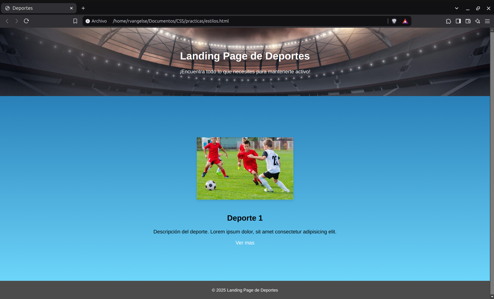

# Estilos

### Fondo
```css
html {
    height: 100%; /* Cubre todo la pagina */
}

body { /* El tamaño se adapta a los elementos */
    margin: 0;
    /* Agregar imagen de fondo */
    /* Imagen - Repeticion - Color */
    background: url(http://www.xaviro.com/assets/img/skills/css.svg) no-repeat, blue;
    /* Fondo por parametros */
    background-repeat: no-repeat;
    background-position: center;
    background-size: 100px;
    background-color: blue;
}
```
OJO: `background-size: cover;` ajusta la imagen de fondo al tamaño del contenedor.

---
### Color
```css
h1 {
    /* Color del texto */
    color: blue; 
    /* Color del fondo */
    background: gray;
    /* Color del borde */
    border: solid 10px green;
    opacity: 0.5;
    /* Colores en RGB */
    color: rgb(255, 0, 0);
    /* Colores en RGBA */
    color: rgba(255, 0, 0, 1);
    /* Colores en Hexadecimal */
    color: #0011ff;
}
```
OJO: Es recomendable usar los formatos `RGB` y `RGBA` 

OJO: Prueba este [recurso](https://gradients.app/es/new) para crear gradientes.

---
### Modelos

```css
div {
    /* Modelo hsl (Es mas tecnico) */
    /* Matiz - Saturacion - Luz */
    color: hsl(120, 100%, 50%);
    /* Modelo hsla */
    /* Matiz - Saturacion - Luz - Alfa(Transparencia) */
    color: hsla(120, 100%, 50%, 0.5);
    /* Modelo lab (Tiene mas precision) (Uso cientifico) */
    background-color: lab(100 0 100);
    /* Modelo lch (Ayuda mucho con los contrastes) */ 
    /* Luminosidad - Croma - Matiz */
    background-color: lch(40% 100 0);
    /* Modelo oklch (Funciona igual que lch, pero es de uso cientifico) */
    background-color: oklch(0.41 0.44 1.18);
}
```  
OJO: Puedes usar herramientas como [lab](https://observablehq.com/@d3/lab-color-picker) y [lch](https://lch.oklch.com/#70,39,227,100) para tener una mejor visualizacion de los colores en cada modelo. 

---

### Mezcla de colores 

```css

div {   /* Mezcla de colores usando el modelo rgb */
        background-color: color-mix(in srgb, red 50%, blue 50%);
        /* Mezcla de colores usando el modelo hsl */
        background-color: color-mix(in hsl, red 50%, blue 50%);
        /* Mezcla de colores usando el modelo lch */ 
        background-color: color-mix(in lch, red 50%, blue 50%); 
}
```
---
### Colores relativos
Sirve para transformar un color a otro.

```css
:root {
        --principal: blue; /* Declaro una variable global "principal" */
}

div {
      /* Transformacion del color azul a un color relativo, usando modelo hsl */
      background: hsl(from var(--principal) calc(h + 100) s l);
}
```
---
### Practica 4: Estilos en CSS

**Codigo**
```html
<!DOCTYPE html>
<html lang="es">
<head>
    <meta charset="UTF-8">
    <meta name="viewport" content="width=device-width, initial-scale=1.0">
    <title>Deportes</title>
    <style>
        body{
            font-family: Arial, sans-serif;
            margin: 0;
            padding: 0;
        }

        header{
            background-image: url('https://btlive.tv/wp-content/uploads/2020/11/171115171-1140x474.jpg');
            background-repeat: no-repeat;
            color: white;
            background-size: cover;
            background-position: center;
            padding: 50px 0; 
            text-align: center;
        }

        main{
            background: linear-gradient(to bottom, #2980b9, #6dd5fa);
            text-align: center;
            padding: 109px 20px;
        }

        main img{
            width: 100%;
            max-width: 300px;
            margin: 20px auto;
            box-shadow: 0 4px 8px rgba(0, 0, 0, 0.1);
        }

        a{
            text-decoration: none;
            color: white;
        }

        footer{
            background-color: rgba(0, 0, 0, 0.7);
            color: white;
            text-align: center;
            padding: 20px 0;
        }
    </style>
</head>
<body>
    <header>
        <h1>Landing Page de Deportes</h1>
        <p>¡Encuentra todo lo que necesites para mantenerte activo!</p>
    </header>
    <main>
        
        <h2>Deporte 1</h2>
        <p> Descripción del deporte. Lorem ipsum dolor, sit amet consectetur adipisicing elit.</p>
        <a href="#">Ver mas</a>
    </main>
    <footer>
        <small>&copy 2025 Landing Page de Deportes</small>
    </footer>
</body>
</html>
```
**Output**

<p align="center">
  
</p>


