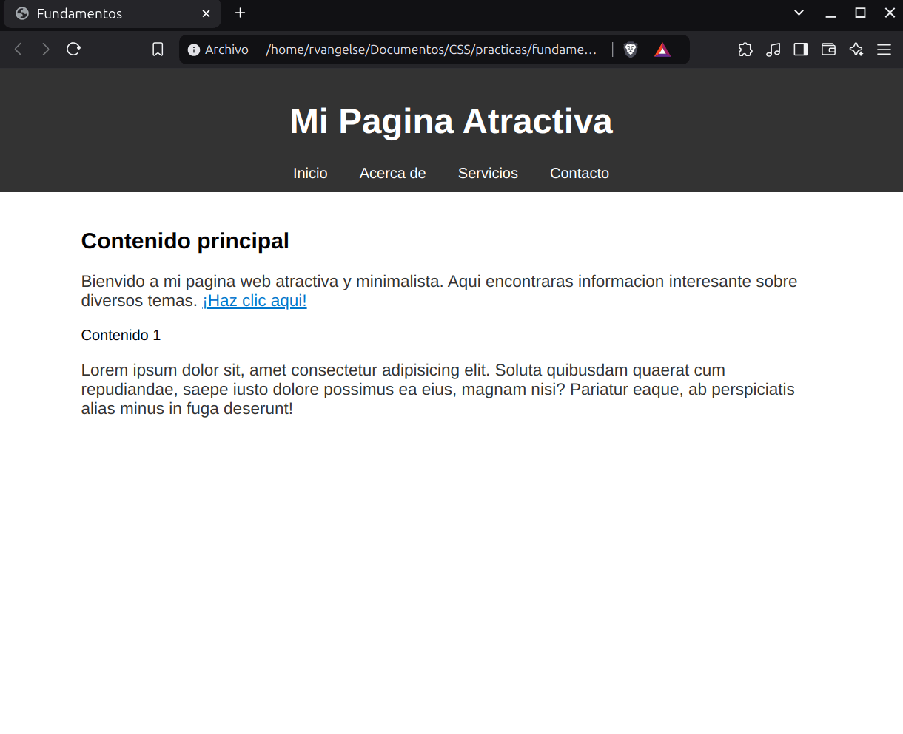

# Fundamentos de CSS 

### Sintaxis

<p align="center">
  
</p>

OJO: Siempre verifica detenidamente tus selectores y asegúrate de que las propiedades estén correctamente asignadas. Recuerda usar el punto (.) para las clases y numeral (#) para las id.

---
### Selectores

```css
    p { /* Selector de etiquetas */
      color: blue;
      font-size: 25px;
    }

    .clase-texto { /* Selector de clases */
      color: red;
      font-size: 25px;
    }

    #texto-unico { /* Selector de id */
      color: green;
      font-size: 25px;
    }

    .clase-texto span { /* Selector de una etiqueta en una clase */
      color: purple;
      font-size: 25px;
    }

    p,
    span { /* Selector de un grupo de etiquetas */
      text-decoration: underline;
    }
```
El `*` es el selector global.

OJO: Es recomendable siempre agrupar elementos en clases y usar las id, en casos especiales.

OJO: Es una buena practica definir las clases usando `minusculas` y `-`. 

---
### Cascada y herencia

Cascada es el efecto en el que el último elemento que tiene el mismo estilo y la misma especificidad gana.

```html
<!-- En este caso, por cascada el ultimo "color" es el que se aplica -->
<!DOCTYPE html>
<html>

<head>
  <style>
    p {
      color: red;
    }
  </style>
  <link rel="stylesheet" href="./styles.css" />
</head>

<body>
  <!-- Estilo efectivo -->
  <p style="color: green;">Texto</p> 
</body>

</html>
```
---
### Especificidad

La especificidad del selector pesa mas que la herencia de la cascada, al aplicar estilos.

```html
<!-- Especificidad -->
<!-- Etiqueta/clase/id > id > clase > Etiqueta Especifica > Etiqueta Global -->

<!DOCTYPE html>
<html>

<head>
  <style>
    p.textos#texto1 { /* > */
      color: blue !important;
    }

    p.textos#texto1 { /* > */
      color: green;
    }

    #texto1 { /* > */
      color: yellow;
    }

    .textos { /* > */
      color: orange;
    }

    p { /* > */
      color: red;
    }

    body { /* > */
      color: purple;
      font-size: 25px;
    }
  </style>
</head>

<body>
  <p id="texto1" class="textos">Texto</p>
</body>

</html>
```

OJO: Manten tu CSS lo más simple posible. Utiliza selectores de clase en lugar de selectores de id o de etiquetas cuando sea posible.

---
### Unidades

```css

    h1 { /* Unidades: */
      background: greenyellow;
      /* px, unidad absoluta */
      width: 300px;
      /* %, unidad relativa al tamaño en px del padre */
      width: 50%; 
      /* em, unidad relativa al font-size en px del padre */
      font-size: 3em; /* 3 veces el tamaño del padre */
      /* rem, unidad relativa al font-size en px de la raiz */
      font-size: 3rem;
    }

```
OJO: No uses unidades en `px` para todos los elementos de diseño. Considera el uso de unidades relativas como `em`, `rem` y `%` para crear diseños más flexibles y accesibles.

---
### Practica 1: Fundamentos de CSS

**Codigo**

```html
<!DOCTYPE html>
<html lang="es">
<head>
    <meta charset="UTF-8">
    <meta name="viewport" content="width=device-width, initial-scale=1.0">
    <title>Fundamentos</title>
    <style>
        body{ /* Reseteo los estilos */
            font-family: 'Arial', sans-serif;
            margin: 0;
            padding: 0;
        }
        #cabecera{
            background-color: #333;
            color: white;
            padding: 10px; /* Relleno del header */
            text-align: center; /* Alineacion */
        }
        #cabecera h1{
            font-size: 38px; /* Tamaño de la fuente */
            text-align: center;
        }
        #menu a{
            color: white;
            text-decoration: none; /* Quitar subrayado */
            margin: 10px; /* Espacio entre elementos */
        }
        #principal{
            max-width: 800px; /* Ancho maximo */
            margin: auto; 
            padding: 20px;
        }
        p {
            font-size: 18px;
            color: #333;
        }
        a {
            color: #0077cc;
        }
    </style>
</head>
<body>
    <header id="cabecera">
        <h1>Mi Pagina Atractiva</h1>
        <nav id = "menu">
            <a href="#">Inicio</a>
            <a href="#">Acerca de</a>
            <a href="#">Servicios</a>
            <a href="#">Contacto</a>
        </nav>
    </header>
    <main id="principal">
        <section>
            <h2><strong>Contenido principal</strong></h2>
            <p>Bienvido a mi pagina web atractiva y minimalista. Aqui encontraras informacion interesante sobre diversos temas. <a href="#">¡Haz clic aqui!</a></p>
        </section>
        <section>
            <span>Contenido 1</span>
            <p>Lorem ipsum dolor sit, amet consectetur adipisicing elit. Soluta quibusdam quaerat cum repudiandae, saepe iusto dolore possimus ea eius, magnam nisi? Pariatur eaque, ab perspiciatis alias minus in fuga deserunt!</p>
        </section>
    </main>
</body>
</html>
```
**Output**

<p align="center">
  
</p>
