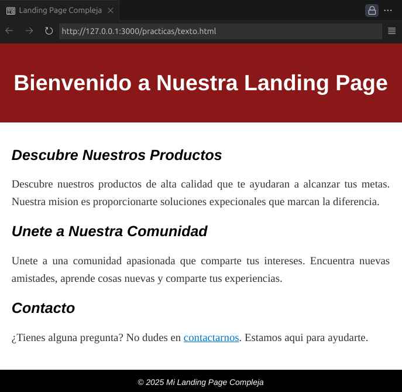

# Texto en CSS

### Fuentes

```html
<head>
  <!-- Forma 1 para importar fuentes (HTML) -->
  <link rel="preconnect" href="https://fonts.gstatic.com" />
  <link href="https://fonts.googleapis.com/css2?family=Ubuntu+Mono&display=swap" rel="stylesheet" />
  <style>
    /* Forma 2 para importar fuentes (CSS) */
    @import url("https://fonts.googleapis.com/css2?family=Ubuntu+Mono&display=swap");

    p {
      font-family: "Ubuntu Mono", monospace; /* Fuente */
      font-weight: lighter; /* Grosor de la fuente */
      font-style: oblique; /* Estilo de la fuente */
      font-size: 25px; /* Tamaño de la fuente */
    }
  </style>
</head>
```
OJO: Puedes importar fuentes de [Google](https://fonts.google.com/).

---
### Transformaciones
Puedes usar el atributo `text-transform` para transformar un texto de mayusculas a minusculas y viceversa, usando CSS.

```css
p{  /* A mayusculas */
    text-transform: uppercase;
    /* A minusculas */ 
    text-transform: lowercase;
    /* A mayusculas solo las primeras letras de cada palabra */ 
    text-transform: capitalize; 
}
```
---

### Espaciamiento

```css
/* Conserva los espacios y saltos de línea */
.preserve {
    white-space: pre;
}
/* No permite saltos de línea y trunca el texto */
.nowrap {
    white-space: nowrap;
}
/* Permite romper palabras largas */
.word-wrap {
    word-wrap: break-word;
}
/* Envolturas de texto */
.text-wrap {
    /* Texto distribuido de forma balanceada */
    text-wrap: balance; 
    /* Texto distribuido esteticamente */
    text-wrap: pretty;
}
```
---
### Alineamiento

```css
span{
    /* Espacio entre letras */
    letter-spacing: 1px;
    /* Espacio entre palabras */
    word-spacing: 1px;
    /* Alineacion del texto */
    text-align: center;
}
```
---
### Efectos

```css
/*Sombras*/
div{
    text-shadow: 1px 2px black;
    /* X - Y - Radio - Color */ 
}

/*Subrayado*/
a{  /* Elimina el subrayado */
    text-decoration: none;
}
```
---

### Practica 2: Texto en CSS

**Codigo**

```html
<!DOCTYPE html>
<html lang="es">
<head>
    <meta charset="UTF-8">
    <meta name="viewport" content="width=device-width, initial-scale=1.0">
    <title>Landing Page Compleja</title>
    <style>
        body{
            font-family: Arial, sans-serif;
            margin: 0;
            padding: 0;
        }
        header{
            background-color: hsl(0, 70%, 32%);
            color: white;
            text-align: center;
            padding: 20px;
        }
        header h1 {
            font-family: 'Helvetica Neue', Helvetica, Arial, sans-serif;
            font-size: 36px;
            font-weight: bold;
        }
        main{
            max-width: 1200px;
            margin: auto;
            padding: 20px;
            margin-bottom: 0px;
            box-shadow: 0 0 10px rgba(0, 0, 0, 0.1);
        }
        footer{
            padding: 10px 0;
            background-color: black;
            color: white;
            text-align: center;
            font-style: oblique;
        }
        a{
            color: #0077cc;
        }
        p{
            font-family: 'Georgia', 'Times New Roman', serif;
            font-size: 18px;
            color: #333;
            line-height: 1.6;
            text-align: justify;
        }
        h2{
            font-family: 'Helvetica Neue', Helvetica, Arial, sans-serif;
            font-size: 24px;
            font-weight: bold;
            font-style: italic;
            margin: 20px 0;
        }
       
    </style>
</head>
<body>
    <header>
        <h1>Bienvenido a Nuestra Landing Page</h1>
    </header>
    <main>
        <section>
            <h2>Descubre Nuestros Productos</h2>
            <p>
               Descubre nuestros productos de alta calidad que te ayudaran a alcanzar tus metas.
               Nuestra mision es proporcionarte soluciones expecionales que marcan la diferencia.
            </p>
        </section>
        <section>
            <h2>Unete a Nuestra Comunidad</h2>
            <p>
                Unete a una comunidad apasionada que comparte tus intereses. 
                Encuentra nuevas amistades, aprende cosas nuevas y comparte tus experiencias.
            </p>
        </section>
        <section>
            <h2>Contacto</h2>
            <p>¿Tienes alguna pregunta? No dudes en <a href="#">contactarnos</a>. Estamos aqui para ayudarte.</p>
        </section>
    </main>
    <footer>
        <small>&copy 2025 Mi Landing Page Compleja</small>
    </footer>  
</body>
</html>
```
**Output**

<p align="center">
  
</p>
    

